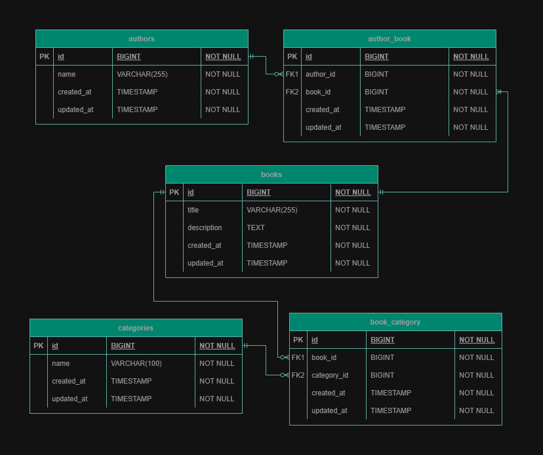

# Widi Pustaka

## Overview
Widi Pustaka is a book management API, which provide endpoints to manage books, authors and categories. It support CRUD operations allowing clients to create, read, update and delete resources.

## Table of Contents
- [Installation](#installation)
- [Configuration](#configuration)
- [Allowed Http Request](#allowed-http-request)
- [Possible Server Responses](#possible-server-responses)
- [Attributes](#attributes)
    - [Author Attributes](#author-attributes)
    - [Book Attributes](#book-attributes)
    - [Category Attributes](#category-attributes)
- [API Endpoints](#api-endpoints)
  - [Authors](#authors)
    - [Get All](#authors-index)
    - [Get by Id](#authors-show)
    - [Create](#authors-create)
    - [Update](#authors-update)
    - [Delete](#authors-delete)
  - [Books](#books)
    - [Get All](#books-index)
    - [Get by Id](#books-show)
    - [Create](#books-create)
    - [Update](#books-update)
    - [Delete](#books-delete)
  - [Categories](#categories)
    - [Get All](#categories-index)
    - [Get by Id](#categories-show)
    - [Create](#categories-create)
    - [Update](#categories-update)
    - [Delete](#categories-delete)
- [Validation](#validation)
- [Error Handling](#error-handling)
- [Entity Relationship Diagram](#entity-relationship-diagram)

## Installation
To set up the Widi Pustaka book management API, follow this steps:

1. Clone the repository:
```sh
git clone https://github.com/NymWidana/widi-pustaka.git
cd widi-pustaka
```

2. Install dependencies:
```sh
composer install
```

3. Copy the environment file and configure the anvironment variables:
```sh
cp .env.example .env
```
Update the `env` file with your database credentials and other necessary configuration.

4. Generate an application key:
```sh
php artisan key:generate
```

5. Run the database migrations and seeder
```sh
php artisan migrate --seed
```

6. Start the development server:
```sh
php artisan serve
```

## Configuration
Ensure that the folowing environment variables is configured in your `.env` file correctly:
- `DB_DATABASE`
- `DB_USERNAME`
- `DB_PASSWORD`

## Allowed Http Request
- GET: To GET data from the API
- POST: To send POST request to the API (Create data)
- PUT: To send PUT request to the API (Update data)
- DELETE: To DELETE data on the API

## Possible Server Responses
- 200 `ok`: Request was successfull
- 201 `created`: Request to create or update was successfull
- 404 `not found`: Requested data was not found
- 409 `conflict`: Request conflicts with the current state of the server
- 500 `internal server error`: The server has encountered a situation it doesn't know how to handle

## Attributes
### Author Attributes
- id `BIGINT`: Uniques Identifier (Primary Key)
- name `VARCHAR`: Author name

### Book Attributes
- id `BIGINT`: Uniques Identifier (Primary Key)
- title `VARCHAR`: Book Title
- description `VARCHAR`: Book Description

### Category Attributes
- id `BIGINT`: Uniques Identifier (Primary Key)
- name `VARCHAR`: Category Name

## API Endpoints
### Books
- __<h4 id="books-index">Get All Books</h4>__
    
    __Endpoint__
    ```http
    GET /api/books
    ```

    __Request URL Example__
    ```http
    http://localhost:8000/api/books
    ```

    __Response Example__
    ```json
    {
        "code": 200,
        "data": [
            {
                "id": 1,
                "title": "Open-source nextgeneration application",
                "description": "Perspiciatis sapiente rerum mollitia aut nihil accusamus dicta. Dolorum eos id tenetur repellendus.",
                "created_at": "2025-02-20T11:20:46.000000Z",
                "updated_at": "2025-02-20T11:20:46.000000Z",
                "authors": [
                    {
                        "id": 4,
                        "name": "Darlene Labadie"
                    },
                    {
                        "id": 31,
                        "name": "Constantin Blick"
                    }
                ],
                "category": [
                    {
                        "id": 30,
                        "name": "Research Journals"
                    },
                    {
                        "id": 32,
                        "name": "Art & Photography"
                    },
                    {
                        "id": 39,
                        "name": "Crafts & Hobbies"
                    },
                    {
                        "id": 58,
                        "name": "Philosophy"
                    }
                ]
            },
            {
                "id": 2,
                "title": "Centralized well-modulated internetsolution",
                "description": "Aperiam iusto illo minima et nesciunt sint non. Harum ratione voluptas sed incidunt.",
                "created_at": "2025-02-20T11:20:46.000000Z",
                "updated_at": "2025-02-20T11:20:46.000000Z",
                "authors": [
                    {
                        "id": 32,
                        "name": "Loyce Kutch"
                    }
                ],
                "category": [
                    {
                        "id": 3,
                        "name": "Science Fiction"
                    },
                    {
                        "id": 61,
                        "name": "Maps & Atlases"
                    },
                    {
                        "id": 69,
                        "name": "Sports & Recreation"
                    }
                ]
            },
            {
                "id": 3,
                "title": "Multi-layered client-driven flexibility",
                "description": "Corporis ut et quasi doloribus. Voluptate corporis dolores ut ut quidem.",
                "created_at": "2025-02-20T11:20:46.000000Z",
                "updated_at": "2025-02-20T11:20:46.000000Z",
                "authors": [
                    {
                        "id": 18,
                        "name": "Franz Lind DVM"
                    }
                ],
                "category": [
                    {
                        "id": 3,
                        "name": "Science Fiction"
                    },
                    {
                        "id": 37,
                        "name": "Cooking & Food"
                    },
                    {
                        "id": 40,
                        "name": "Fashion & Beauty"
                    },
                    {
                        "id": 52,
                        "name": "Short Stories"
                    }
                ]
            }
        ],
        "success": true,
        "message": "Successfully retrieved all books data!"
    }
    ```

- __<h4 id="books-show">Get Book by ID</h4>__
    
    __Endpoint__
    ```http
    GET /api/books/{id}
    ```

    __Request URL Example__
    ```http
    http://localhost:8000/api/books/1
    ```

    __Response Example__
    ```json
    {
        "code": 200,
        "data": {
            "id": 1,
            "title": "Open-source nextgeneration application",
            "description": "Perspiciatis sapiente rerum mollitia aut nihil accusamus dicta. Dolorum eos id tenetur repellendus.",
            "created_at": "2025-02-20T11:20:46.000000Z",
            "updated_at": "2025-02-20T11:20:46.000000Z",
            "authors": [
                {
                    "id": 31,
                    "name": "Constantin Blick"
                },
                {
                    "id": 4,
                    "name": "Darlene Labadie"
                }
            ],
            "category": [
                {
                    "id": 32,
                    "name": "Art & Photography"
                },
                {
                    "id": 39,
                    "name": "Crafts & Hobbies"
                },
                {
                    "id": 30,
                    "name": "Research Journals"
                },
                {
                    "id": 58,
                    "name": "Philosophy"
                }
            ]
        },
        "success": true,
        "message": "Successfully retrieved the book data!"
    }
    ```

- __<h4 id="books-create">Create Book</h4>__
    
    __Endpoint__
    ```http
    POST /api/books
    ```

    __Request Body Format__
    - title : `string`, required, max of 255 characters
    - description : `string`, optional
    - authors : `integer` or `array` of `integer`, required
    - categories : `integer` or `array` of `integer`, optional

    __Request URL Example__
    ```http
    http://localhost:8000/api/books
    ```

    __Request Body Example__
    ```json
    {
        "title" : "New Book",
        "description" : "New Book Description",
        "authors" : [1, 2],
        "categories" : [3, 4]
    }
    ```

    __Response Example__
    ```json
    {
        "code": 201,
        "data": {
            "id": 109,
            "title": "New Book",
            "description": "New Book Description",
            "created_at": "2025-02-25T11:31:37.000000Z",
            "updated_at": "2025-02-25T11:31:37.000000Z",
            "authors": [
                {
                    "id": 1,
                    "name": "Melody Terry"
                },
                {
                    "id": 2,
                    "name": "Jayde Jacobs"
                }
            ],
            "category": [
                {
                    "id": 3,
                    "name": "Science Fiction"
                },
                {
                    "id": 4,
                    "name": "Fantasy"
                }
            ]
        },
        "success": true,
        "message": "Successfully saved a book data!"
    }
    ```

- __<h4 id="books-update">Update Book</h4>__
    
    __Endpoint__
    ```http
    PUT /api/books/{id}
    ```

    __Request Body Format__
    - title : `string`, optional, max of 255 characters
    - description : `string`, optional
    - authors : `integer` or `array` of `integer`, optional
    - categories : `integer` or `array` of `integer`, optional

    __Request URL Example__
    ```http
    http://localhost:8000/api/books/109
    ```

    __Request Body Example__
    ```json
    {
        "title" : "Updated Book",
        "description" : "Updated Book Description",
        "authors" : [3, 4],
        "categories" : [5, 6, 7]
    }
    ```

    __Response Example__
    ```json
    {
        "code": 201,
        "data": {
            "id": 109,
            "title": "Updated Book",
            "description": "Updated Book Description",
            "created_at": "2025-02-25T11:31:37.000000Z",
            "updated_at": "2025-02-25T11:35:27.000000Z",
            "authors": [
                {
                    "id": 3,
                    "name": "Lenora Bosco"
                },
                {
                    "id": 4,
                    "name": "Darlene Labadie"
                }
            ],
            "category": [
                {
                    "id": 5,
                    "name": "Romance"
                },
                {
                    "id": 6,
                    "name": "Historical Fiction"
                },
                {
                    "id": 7,
                    "name": "Thriller"
                }
            ]
        },
        "success": true,
        "message": "Successfully updated a book data!"
    }
    ```

- __<h4 id="books-delete">Delete Book</h4>__
    
    __Endpoint__
    ```http
    DELETE /api/books/{id}
    ```

    __Request URL Example__
    ```http
    http://localhost:8000/api/books/101
    ```

    __Response Example__
    ```json
    {
        "code": 200,
        "data": {
            "id": 109,
            "title": "Updated Book",
            "description": "Updated Book Description",
            "created_at": "2025-02-25T11:31:37.000000Z",
            "updated_at": "2025-02-25T11:35:27.000000Z",
            "authors": [
                {
                    "id": 3,
                    "name": "Lenora Bosco"
                },
                {
                    "id": 4,
                    "name": "Darlene Labadie"
                }
            ],
            "category": [
                {
                    "id": 5,
                    "name": "Romance"
                },
                {
                    "id": 6,
                    "name": "Historical Fiction"
                },
                {
                    "id": 7,
                    "name": "Thriller"
                }
            ]
        },
        "success": true,
        "message": "Successfully deleted a book data!"
    }
    ```

### authors
- __<h4 id="authors-index">Get All Authors</h4>__
    
    __Endpoint__
    ```http
    GET /api/authors
    ```

    __Request URL Example__
    ```http
    http://localhost:8000/api/authors
    ```

    __Response Example__
    ```json
    {
        "code": 200,
        "data": [
            {
                "id": 1,
                "name": "Melody Terry",
                "created_at": "2025-02-20T11:20:46.000000Z",
                "updated_at": "2025-02-20T11:20:46.000000Z",
                "books": [
                    {
                        "id": 38,
                        "title": "Cross-group web-enabled securedline"
                    },
                    {
                        "id": 55,
                        "title": "Virtual tangible capability"
                    },
                    {
                        "id": 90,
                        "title": "Compatible scalable encoding"
                    }
                ]
            },
            {
                "id": 2,
                "name": "Jayde Jacobs",
                "created_at": "2025-02-20T11:20:46.000000Z",
                "updated_at": "2025-02-20T11:20:46.000000Z",
                "books": [
                    {
                        "id": 7,
                        "title": "Devolved content-based toolset"
                    },
                    {
                        "id": 26,
                        "title": "Total heuristic firmware"
                    },
                    {
                        "id": 27,
                        "title": "Facetoface static matrices"
                    },
                    {
                        "id": 77,
                        "title": "Monitored high-level collaboration"
                    },
                    {
                        "id": 91,
                        "title": "Compatible multi-state openarchitecture"
                    }
                ]
            },
            {
                "id": 3,
                "name": "Lenora Bosco",
                "created_at": "2025-02-20T11:20:46.000000Z",
                "updated_at": "2025-02-20T11:20:46.000000Z",
                "books": [
                    {
                        "id": 22,
                        "title": "Compatible zerodefect project"
                    },
                    {
                        "id": 30,
                        "title": "Profound global help-desk"
                    },
                    {
                        "id": 50,
                        "title": "Visionary modular installation"
                    },
                    {
                        "id": 71,
                        "title": "Robust optimizing archive"
                    }
                ]
            }
        ],
        "success": true,
        "message": "Successfully retrieved all authors data!"
    }
    ```

- __<h4 id="authors-show">Get Author by ID</h4>__
    
    __Endpoint__
    ```http
    GET /api/authors/{id}
    ```

    __Request URL Example__
    ```http
    http://localhost:8000/api/authors/1
    ```

    __Response Example__
    ```json
    {
        "code": 200,
        "data": {
            "id": 1,
            "name": "Melody Terry",
            "created_at": "2025-02-20T11:20:46.000000Z",
            "updated_at": "2025-02-20T11:20:46.000000Z",
            "books": [
                {
                    "id": 38,
                    "title": "Cross-group web-enabled securedline"
                },
                {
                    "id": 55,
                    "title": "Virtual tangible capability"
                },
                {
                    "id": 90,
                    "title": "Compatible scalable encoding"
                },
                {
                    "id": 105,
                    "title": "Updated Book"
                },
                {
                    "id": 106,
                    "title": "Updated Book"
                },
                {
                    "id": 107,
                    "title": "Updated Book"
                }
            ]
        },
        "success": true,
        "message": "Successfully retrieved the author data!"
    }
    ```

- __<h4 id="authors-create">Create Author</h4>__
    
    __Endpoint__
    ```http
    POST /api/authors
    ```

    __Request Body Format
    - name: `string`, required, max of 255 characters

    __Request URL Example__
    ```http
    http://localhost:8000/api/authors
    ```

    __Request Body Example__
    ```json
    {
        "name" : "New Author"
    }
    ```

    __Response Example__
    ```json
    {
        "code": 201,
        "data": {
            "id": 54,
            "name": "New Author",
            "created_at": "2025-02-25T11:49:45.000000Z",
            "updated_at": "2025-02-25T11:49:45.000000Z",
            "books": []
        },
        "success": true,
        "message": "Successfully saved an author data!"
    }
    ```

- __<h4 id="authors-update">Update Author</h4>__
    
    __Endpoint__
    ```http
    PUT /api/authors/{id}
    ```

    __Request Body Format
    - name: `string`, optional, max of 255 characters

    __Request URL Example__
    ```http
    http://localhost:8000/api/authors/54
    ```

    __Request Body Example__
    ```json
    {
        "name" : "Updated Author"
    }
    ```

    __Response Example__
    ```json
    {
        "code": 201,
        "data": {
            "id": 54,
            "name": "Updated Author",
            "created_at": "2025-02-25T11:49:45.000000Z",
            "updated_at": "2025-02-25T11:50:44.000000Z",
            "books": []
        },
        "success": true,
        "message": "Successfully updated an author data!"
    }
    ```

- __<h4 id="authors-delete">Delete Author</h4>__
    
    __Endpoint__
    ```http
    DELETE /api/authors/{id}
    ```

    __Request URL Example__
    ```http
    http://localhost:8000/api/authors/54
    ```

    __Response Example__
    ```json
    {
        "code": 200,
        "data": {
            "id": 54,
            "name": "Updated Author",
            "created_at": "2025-02-25T11:49:45.000000Z",
            "updated_at": "2025-02-25T11:50:44.000000Z",
            "books": []
        },
        "success": true,
        "message": "Successfully deleted an author data!"
    }
    ```

### Categories
- __<h4 id="categories-index">Get All Categories</h4>__
    
    __Endpoint__
    ```http
    GET /api/categories
    ```

    __Request URL Example__
    ```http
    http://localhost:8000/api/categories
    ```

    __Response Example__
    ```json
    {
        "code": 200,
        "data": [
            {
                "id": 1,
                "name": "Fiction",
                "created_at": "2025-02-20T11:20:45.000000Z",
                "updated_at": "2025-02-20T11:20:45.000000Z",
                "books": [
                    {
                        "id": 30,
                        "title": "Profound global help-desk"
                    },
                    {
                        "id": 35,
                        "title": "Open-architected multimedia hub"
                    },
                    {
                        "id": 80,
                        "title": "Centralized analyzing groupware"
                    },
                    {
                        "id": 84,
                        "title": "Inverse context-sensitive instructionset"
                    }
                ]
            },
            {
                "id": 2,
                "name": "Mystery",
                "created_at": "2025-02-20T11:20:45.000000Z",
                "updated_at": "2025-02-20T11:20:45.000000Z",
                "books": [
                    {
                        "id": 12,
                        "title": "Extended analyzing model"
                    },
                    {
                        "id": 75,
                        "title": "Implemented 4thgeneration middleware"
                    }
                ]
            },
            {
                "id": 3,
                "name": "Science Fiction",
                "created_at": "2025-02-20T11:20:45.000000Z",
                "updated_at": "2025-02-20T11:20:45.000000Z",
                "books": [
                    {
                        "id": 2,
                        "title": "Centralized well-modulated internetsolution"
                    },
                    {
                        "id": 3,
                        "title": "Multi-layered client-driven flexibility"
                    },
                    {
                        "id": 80,
                        "title": "Centralized analyzing groupware"
                    },
                    {
                        "id": 94,
                        "title": "Multi-lateral 6thgeneration architecture"
                    }
                ]
            }
        ],
        "success": true,
        "message": "Successfully retrieved all categories data!"
    }
    ```

- __<h4 id="categories-show">Get Category by ID</h4>__
    
    __Endpoint__
    ```http
    GET /api/categories/{id}
    ```

    __Request URL Example__
    ```http
    http://localhost:8000/api/categories/1
    ```

    __Response Example__
    ```json
    {
        "code": 200,
        "data": {
            "id": 1,
            "name": "Fiction",
            "created_at": "2025-02-20T11:20:45.000000Z",
            "updated_at": "2025-02-20T11:20:45.000000Z",
            "books": [
                {
                    "id": 30,
                    "title": "Profound global help-desk"
                },
                {
                    "id": 35,
                    "title": "Open-architected multimedia hub"
                },
                {
                    "id": 80,
                    "title": "Centralized analyzing groupware"
                },
                {
                    "id": 84,
                    "title": "Inverse context-sensitive instructionset"
                }
            ]
        },
        "success": true,
        "message": "Successfully retrieved the category data!"
    }
    ```

- __<h4 id="categories-create">Create Category</h4>__
    
    __Endpoint__
    ```http
    POST /api/categories
    ```

    __Request Body Format
    - name: `string`, required, max of 100 characters

    __Request URL Example__
    ```http
    http://localhost:8000/api/categories
    ```

    __Request Body Example__
    ```json
    {
        "name" : "New Category"
    }
    ```

    __Response Example__
    ```json
    {
        "code": 201,
        "data": {
            "id": 72,
            "name": "New Category",
            "created_at": "2025-02-25T12:04:13.000000Z",
            "updated_at": "2025-02-25T12:04:13.000000Z",
            "books": []
        },
        "success": true,
        "message": "Successfully saved a category data!"
    }
    ```

- __<h4 id="categories-update">Update Category</h4>__
    
    __Endpoint__
    ```http
    PUT /api/categories/{id}
    ```

    __Request Body Format
    - name: `string`, optional, max of 100 characters

    __Request URL Example__
    ```http
    http://localhost:8000/api/categories/71
    ```

    __Request Body Example__
    ```json
    {
        "name" : "Updated Category"
    }
    ```

    __Response Example__
    ```json
    {
        "code": 201,
        "data": {
            "id": 72,
            "name": "Updated Category",
            "created_at": "2025-02-25T12:04:13.000000Z",
            "updated_at": "2025-02-25T12:05:04.000000Z",
            "books": []
        },
        "success": true,
        "message": "Successfully updated a category data!"
    }
    ```

- __<h4 id="categories-delete">Delete Category</h4>__
    
    __Endpoint__
    ```http
    DELETE /api/categories/{id}
    ```

    __Request URL Example__
    ```http
    http://localhost:8000/api/categories/71
    ```

    __Response Example__
    ```json
    {
        "code": 200,
        "data": {
            "id": 72,
            "name": "Updated Category",
            "created_at": "2025-02-25T12:04:13.000000Z",
            "updated_at": "2025-02-25T12:05:04.000000Z",
            "books": []
        },
        "success": true,
        "message": "Successfully deleted a category data!"
    }
    ```

## Validation
Widi Pustaka uses Laravel's validation mecanism. Here are the validation preparation and rules for creating a new book:

___File:___ `app/Http/Requests/StoreBookRequest.php`

```php
    protected function prepareForValidation()
    {   
        // Integer data is turned into array
        // If its not integer it will go to the validation rule 'array', if it isn't array it will fail
        // If its array of non integer value, it will not pass the validation rule 'integer'  of 'category.*' 
        $authors = $this->input('authors');
        $categories = $this->input('categories');
        if (is_int($authors)) {
            $this->merge([
                'authors' => [$authors]
            ]);
        }
        if (is_int($categories)) {
            $this->merge([
                'categories' => [$categories]
            ]);
        }
        
        // Set default value if not present
        $this->merge([
            'description' => $this->input('description', null), 
            'categories' => $this->input('categories', [])
        ]);
    }

    public function rules(): array
    {
        return [
            'title' => 'required|string|max:255',
            'description' => 'nullable|string',
            'categories' => 'nullable|array',
            'categories.*' => 'integer|exists:categories,id',
            'authors' => [
                'required',
                'array',
                new NotEmptyArray
            ],
            'authors.*' => 'integer'
        ];
    }
```
And here are the validation preparation and rules for updating a book:

___File:___ `app/Http/Requests/UpdateBookRequest.php`

```php
    protected function prepareForValidation()
    {
        // Makes sure intended integer data is turned into array
        // If its not integer it will go to the validation rule 'array', if it isn't array it will fail
        // If its array of non integer value, it will not pass the validation rule 'integer'  of 'category.*' 
        $authors = $this->input('authors');
        $categories = $this->input('categories');
        if (is_int($authors)) {
            $this->merge([
                'authors' => [$authors]
            ]);
        }
        if (is_int($categories)) {
            $this->merge([
                'categories' => [$categories]
            ]);
        }
        
        // Set default value if not present
        $this->merge([
            'title' => $this->input('title', null),
            'description' => $this->input('description', null), 
            'categories' => $this->input('categories', null), 
            'authors' => $this->input('authors', null), 
        ]);
    }

    public function rules(): array
    {
        return [
            'title' => 'nullable|string|max:255',
            'description' => 'nullable|string',
            'categories' => 'nullable|array',
            'categories.*' => 'integer|exists:categories,id',
            'authors' => [
                'nullable',
                'array',
                new NotEmptyArray
            ],
            'authors.*' => 'integer'
        ];
    }
```
---

The NotEmptyArray is a simple custom rule to check if the inputed array is empty

___File:___ `app/Rules/NotEmptyArray.php`

```php
    public function validate(string $attribute, mixed $value, Closure $fail): void
    {
        if (is_array($value) && empty($value)) {
            $fail('The book '.$attribute.' array must not be empty');
        }
    }
```
---
Here we have validation rules for creating a new author:

___File:___ `app/Http/Requests/StoreAuthorRequest.php`

```php
    public function rules(): array
    {
        return [
            'name' => 'required|string|max:255'
        ];
    }
```
Here we have validation preparation and rules for updating an author:

___File:___ `app/Http/Requests/UpdateAuthorRequest.php`

```php
    protected function prepareForValidation()
    {
        // Set default value if not present
        $this->merge([
            'name' => $this->input('name', null)
        ]);
    }

    public function rules(): array
    {
        return [
            'name' => 'nullable|string|max:255'
        ];
    }
```
---
Here we have validation rules for creating a new category:

___File:___ `app/Http/Requests/StoreCategoryRequest.php`

```php
    public function rules(): array
    {
        return [
            'name' => 'required|string|max:100'
        ];
    }
```
Here we have validation preparation and rules for updating a category:

___File:___ `app/Http/Requests/UpdateCategoryRequest.php`

```php
    protected function prepareForValidation()
    {
        // Set default value if not present
        $this->merge([
            'name' => $this->input('name', null)
        ]);
    }

    public function rules(): array
    {
        return [
            'name' => 'nullable|string|max:100'
        ];
    }
```

## Error Handling

| Error Code | Description   | Possible Solution |
|---|---|---|
| 404   | Not Found | Check if the requested resource exists    |
| 409   | Conflict | Check if the instance targeted still has relation to other instance    |
| 422   | Unprocessable Entity | Check the request body for anything that doesn't meet the validation requirements    |
| 500   | Internal Server Error | Check the server log for more details on the issue    |

## Entity Relationship Diagram
